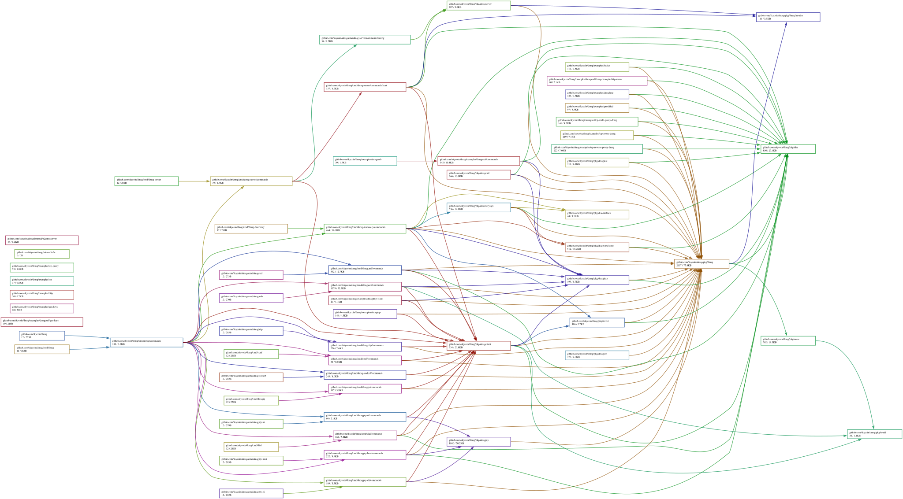

[](https://goreportcard.com/report/github.com/skycoin/dmsg)


[](https://api.securityscorecards.dev/projects/github.com/skycoin/dmsg)
[](https://github.com/skycoin/dmsg)
[](https://aur.archlinux.org/packages/skywire/)
[](https://aur.archlinux.org/packages/skywire-bin/)

# dmsg

`dmsg` (read as *D-message*) is an anonymous relay system and encrypted transport layer used as the control plane for [Skywire](https://github.com/skycoin/skywire). It provides public key-based routing between clients relayed by servers, with end-to-end encryption via the Noise Protocol (ChaCha20-Poly1305 / secp256k1).

## Architecture

The dmsg network is comprised of three types of services:

- **`dmsg.Discovery`** — identifies servers and clients by their `secp256k1` public keys, similar to DNS for the dmsg network.
- **`dmsg.Server`** — relays encrypted streams between clients. Servers connect to each other so that clients on different servers can communicate.
- **`dmsg.Client`** — connects to one or more servers to establish sessions and streams with other clients.

```
           [D]

     S(1) ←——→ S(2)
   //   \\      //   \\
  //     \\    //     \\
 C(A)    C(B) C(C)    C(D)
```

Legend:
- `[D]` — `dmsg.Discovery`
- `S(X)` — `dmsg.Server`
- `C(X)` — `dmsg.Client`
- `←——→` — server-to-server connection (enables cross-server relay)

Clients and servers are identified via `secp256k1` public keys and store records of themselves in the discovery. Client records include the public keys of servers they are delegated to.

## Key Concepts

- **Session** — the connection between a client and a server (noise-encrypted TCP + yamux/smux multiplexing).
- **Stream** — a connection between two clients, relayed via one or more servers. Each stream has its own noise handshake for end-to-end encryption. The relay servers cannot read the stream contents.
- **Server-to-Server Relay** — servers connect to each other so that a client on one server can reach a client on another server. A stream is relayed through at most two servers (the client's server and the destination's server).

## Server-to-Server Connections

By default, dmsg servers automatically discover and connect to all other servers registered in the same dmsg discovery. This means clients connected to different servers can reach each other transparently — the stream request is relayed through the server-to-server connection.

Servers can also be configured to connect to specific servers via static config, which is useful for environments without discovery (e.g., direct clients):

```json
{
  "peers": [
    {"public_key": "02abc...", "address": "1.2.3.4:8081"}
  ]
}
```

When a client dials a destination that is not on its own server, the following order is used:
1. Try existing sessions to the destination's delegated servers (direct relay)
2. Try existing sessions to any other connected server (cross-server relay)
3. Establish a new session to the destination's delegated server (last resort)

## Dmsg Tools and Libraries

- [`dmsgcurl`](./docs/dmsgcurl.md) — simplified `curl` over `dmsg`.
- [`dmsgpty`](./docs/dmsgpty.md) — simplified `SSH` over `dmsg`.
- `dmsgweb` — HTTP and raw TCP port forwarding over `dmsg`, with a resolving SOCKS5 proxy for `.dmsg` domains.
- `dmsghttp` — HTTP file server over `dmsg`.
- `dmsg-socks5` — SOCKS5 proxy server and client over `dmsg`.

## Additional Resources

- [`dmsg` examples](./examples)
- [`dmsg.Discovery` documentation](./cmd/dmsg-discovery/README.md)
- [Starting a local `dmsg` environment](./integration/README.md)

## Dependency Graph

Made with [goda](https://github.com/loov/goda):

```
go run github.com/loov/goda@latest graph github.com/skycoin/dmsg/... | dot -Tsvg -o docs/dmsg-goda-graph.svg
```


